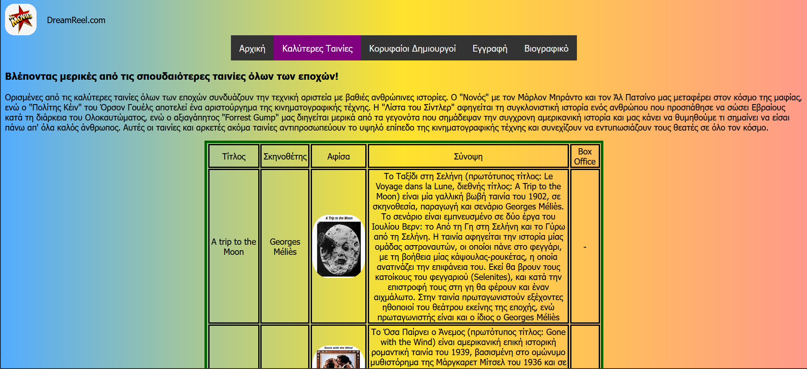
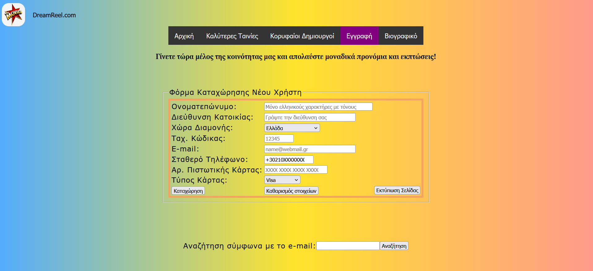

# 🎬 DreamReel.com

A simple yet expressive web app designed for cinema lovers. DreamReel.com presents curated content on top movies and filmmakers, and allows users to register via a dynamic HTML & PHP-based form with data stored in a MySQL database.

  >  🛠️ Developed as part of my web development learning journey during my MSc in Informatics.

## 🌟 Features

 **🎞️ Informational pages on the history of cinema**

 **🎥 Curated lists of top films and directors, with clickable posters linking to Wikipedia**

 **📝 Registration form with front-end validation and server-side PHP logic**

 **🔍 Search form for retrieving registered users by email**

 **💾 MySQL backend with sample data**

## 💡 Technologies Used

   - **HTML5, CSS3**

   - **JavaScript (client-side validation)**

   - **PHP (server-side logic)**

   - **MySQL (database)**

   - **Apache or any local server (e.g., XAMPP/Laragon) for running the PHP backend**

## 📦 How to Set Up Locally

   - Clone the repository

   - Run a local web server (e.g., XAMPP) and place the project in the htdocs folder

   - Create a MySQL database and run the dreamreel_schema.sql file to create and populate the schema

   - Set up your credentials in a file credent.php:

```php
<?php
define("DB_SERVER", "localhost");
define("DB_USER", "root");
define("DB_PASS", "");
define("DB_BASE", "dreamReel");
?>
```

## 🎞️ Cinema Aficionados!

This project is a personal tribute to cinema and an exploration of full-stack fundamentals.
While the content structure is largely static and hardcoded for now, it lays the foundation for more dynamic content delivery in future iterations.

✨ It aspires to become an online hub for cinema aficionados, exploring the profound emotional impact of the Seventh Art on the human soul.

## Preview

- Screenshot of Top Films Page


- Screenshot of Sign Up page

